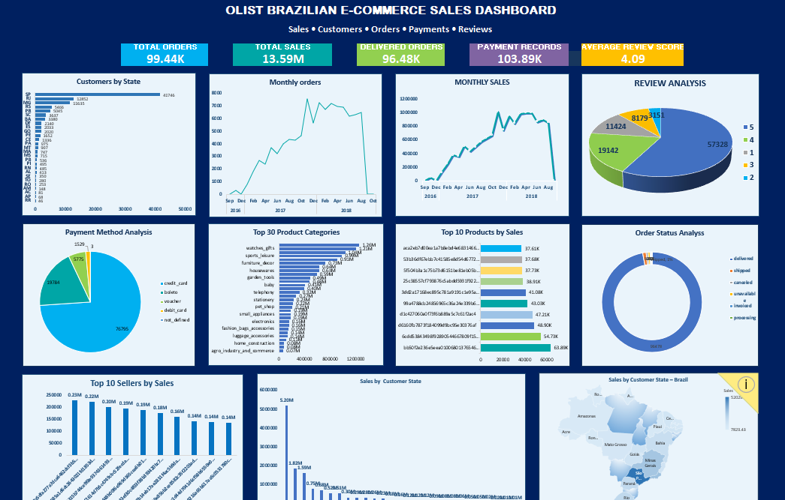
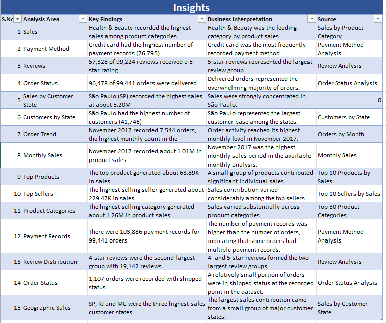
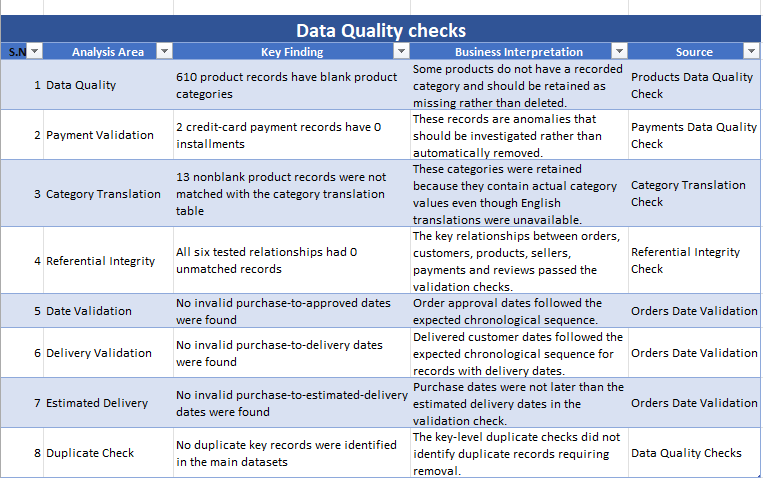
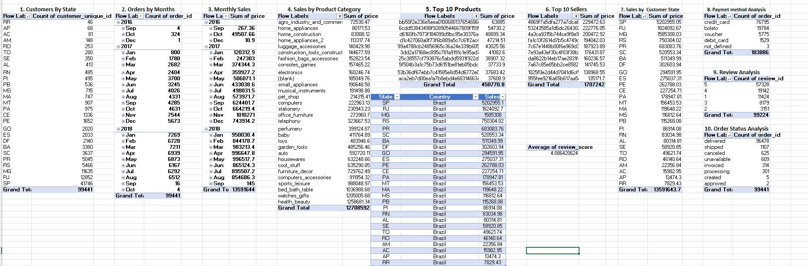
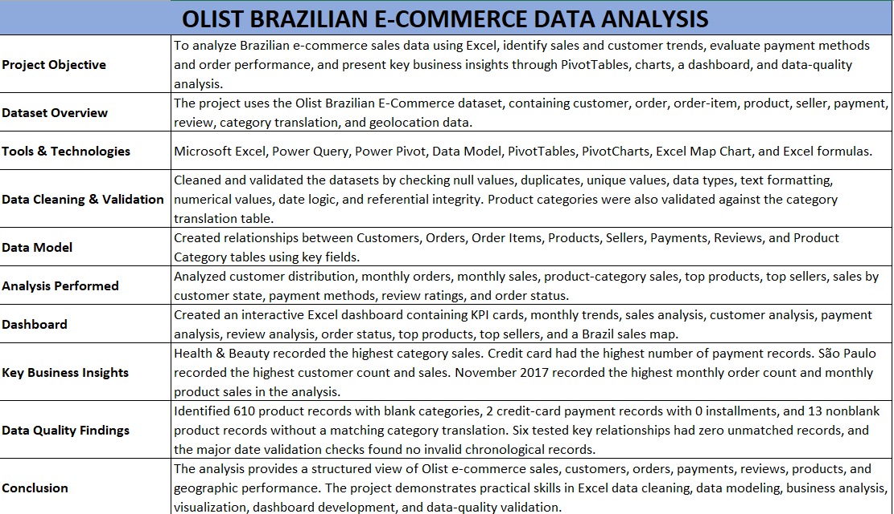
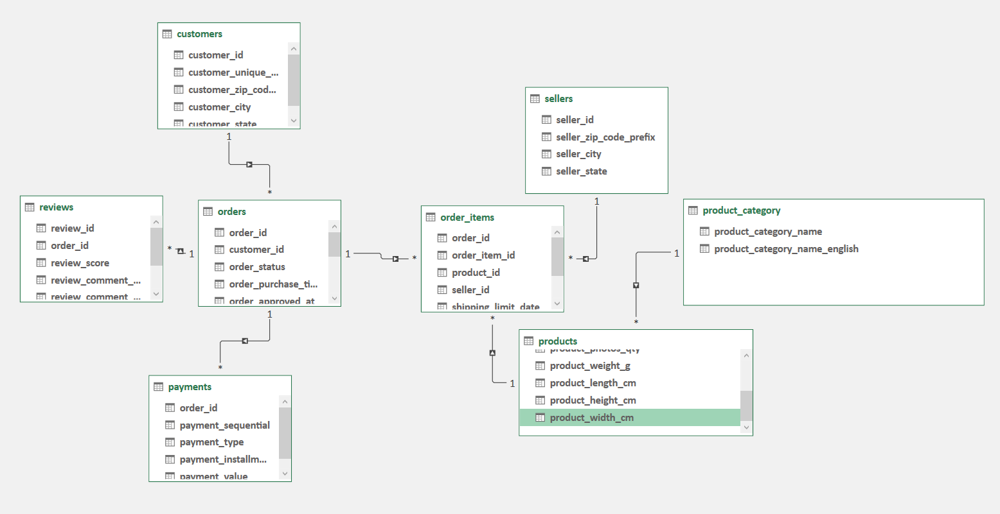

# Olist Brazilian E-Commerce Data Analysis

## 📌 Project Overview

This project analyzes the **Olist Brazilian E-Commerce dataset** using Microsoft Excel to understand sales performance, customer distribution, order trends, payment methods, product categories, seller performance, reviews, and geographic sales.

The project focuses on practical **data cleaning, validation, data modeling, business analysis, visualization, and dashboard development** using Excel.

---

## 🎯 Business Objective

The main objectives of this project are to:

- Analyze e-commerce sales and order trends
- Identify high-performing product categories and products
- Understand customer distribution across Brazilian states
- Analyze payment methods and review ratings
- Evaluate order status and delivery performance
- Identify top-performing sellers
- Understand geographic sales distribution
- Validate data quality and relationships between datasets
- Build an interactive business dashboard for decision-making

---

## 📊 Dataset

The project uses the **Olist Brazilian E-Commerce dataset**.

The dataset contains multiple related tables:

- Customers
- Orders
- Order Items
- Products
- Sellers
- Payments
- Reviews
- Product Category Translation
- Geolocation

The datasets contain information about customers, orders, products, sellers, payments, reviews, and geographic locations.

---

## 🛠️ Tools & Technologies

- **Microsoft Excel**
- **Power Query**
- **Power Pivot**
- **Excel Data Model**
- **PivotTables**
- **PivotCharts**
- **Excel Map Chart**
- **Excel Formulas**

---

## 🔄 Data Preparation & Cleaning

The datasets were prepared using **Power Query** and validated before analysis.

### Data cleaning activities included:

- Checked null and blank values
- Checked duplicate records
- Checked unique values
- Corrected and validated data types
- Trimmed text fields
- Validated numerical columns
- Validated date columns
- Checked business date logic
- Checked referential integrity
- Validated product category translations

### Data validation examples:

- Purchase date vs approved date
- Purchase date vs delivered date
- Purchase date vs estimated delivery date
- Order Items → Orders
- Orders → Customers
- Order Items → Products
- Order Items → Sellers
- Payments → Orders
- Reviews → Orders

All six tested key relationships had **zero unmatched records**.

---

## 🧩 Data Model

Power Pivot was used to create relationships between the main datasets.

The model connects:

- Customers → Orders
- Orders → Order Items
- Orders → Payments
- Orders → Reviews
- Order Items → Products
- Order Items → Sellers
- Products → Product Category

This data model was used to create PivotTables and business analysis.

---

## 📈 Analysis Performed

The project includes the following analyses:

### Customer Analysis
- Customers by State

### Sales Analysis
- Monthly Sales
- Sales by Product Category
- Sales by Customer State

### Order Analysis
- Monthly Orders
- Order Status Analysis

### Product Analysis
- Top 10 Products by Sales
- Product Category Performance

### Seller Analysis
- Top 10 Sellers by Sales

### Payment Analysis
- Payment Method Analysis
- Payment Record Distribution

### Review Analysis
- Review Score Distribution

### Geographic Analysis
- Sales by Customer State
- Brazil Sales Map

---

## 📊 Dashboard

An Excel dashboard was created to provide a consolidated view of the key business metrics.

### Key KPIs

- **Total Orders:** 99,441
- **Total Sales:** 13.59M
- **Delivered Orders:** 96,478
- **Payment Records:** 103,886
- **Average Review Score:** 4.09

### Dashboard includes:

- Monthly Orders Trend
- Monthly Sales Trend
- Product Category Sales
- Top 10 Products
- Top 10 Sellers
- Payment Method Analysis
- Review Analysis
- Order Status Analysis
- Sales by Customer State
- Brazil Sales Map

---

## 💡 Key Business Insights

### Sales
**Health & Beauty** recorded the highest sales among the analyzed product categories.

### Payment Methods
**Credit card** had the highest number of payment records with **76,795 records**.

### Customer Distribution
**São Paulo (SP)** had the highest number of customers with **41,746 customers**.

### Geographic Sales
**São Paulo (SP)** recorded the highest sales at approximately **5.20M**.

### Order Performance
**96,478 of 99,441 orders** were recorded as delivered.

### Reviews
**57,328 of 99,224 reviews** received a 5-star rating.

### Monthly Orders
**November 2017** recorded the highest monthly order count in the analysis with **7,544 orders**.

### Monthly Sales
**November 2017** recorded approximately **1.01M** in product sales.

### Top Seller
The highest-selling seller in the Top 10 analysis generated approximately **229.47K** in sales.

### Top Product
The highest-selling product in the Top 10 analysis generated approximately **63.89K** in sales.

---

## 🔍 Data Quality Findings

The project also included dedicated data-quality checks.

### Findings

- **610** product records had blank product categories.
- **2** credit-card payment records had 0 installments.
- **13** nonblank product records did not match the category translation table.
- All **six tested key relationships** had zero unmatched records.
- No invalid purchase-to-approved dates were identified.
- No invalid purchase-to-delivery dates were identified.
- No invalid purchase-to-estimated-delivery dates were identified.
- No duplicate key records requiring removal were identified in the main datasets.

The identified anomalies were retained rather than automatically deleted, allowing them to remain traceable for further investigation.

---

## 📷 Project Screenshots

### Dashboard



### Insights



### Data Quality Checks



### PivotTables



### Project Summary



### Data Model



---

## 📁 Project Structure

```text
Olist-Brazilian-Ecommerce-Analysis/
│
├── README.md
│
├── Olist_Brazilian_Ecommerce_Analysis.xlsx
│
├── screenshots/
│   ├── 01_dashboard.png
│   ├── 02_insights.png
│   ├── 03_data_quality.png
│   ├── 04_pivots.png
│   └── 05_project_summary.png
│
└── docs/
    └── data_model.png
